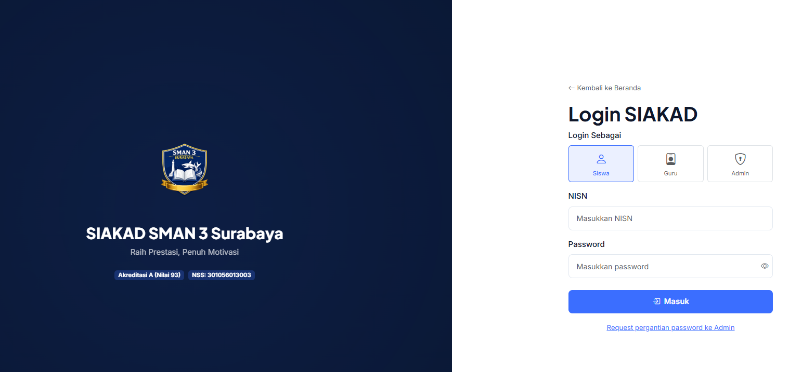
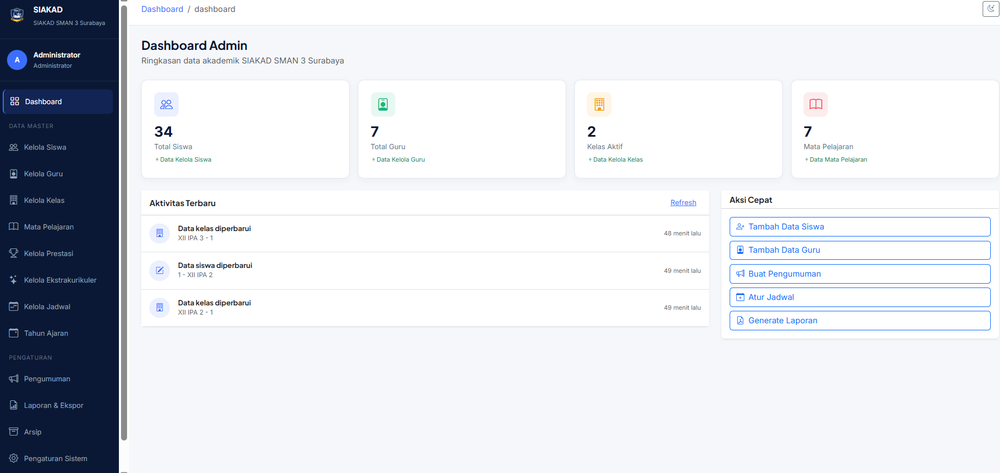
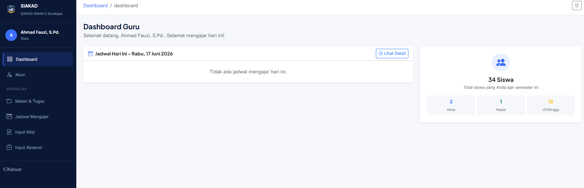
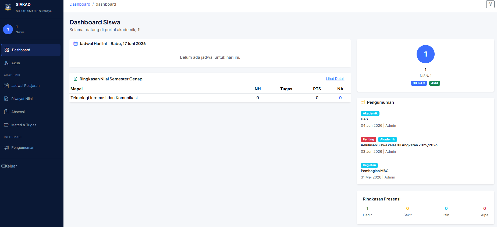

# SIAKAD

School Academic Information System built with React, TypeScript, Express.js, and MySQL for managing students, teachers, attendance, schedules, grades, assignments, and academic administration.

## Features

* Student Management
* Teacher Management
* Class Management
* Attendance Management
* Grade Management
* Schedule Management
* Assignment and Submission Management
* Announcements Management
* Achievement Management
* Multi-Role Access (Admin, Teacher, Student)

## Tech Stack

### Frontend

* React
* TypeScript
* Vite
* React Router
* Bootstrap 5
* Bootstrap Icons
* Radix UI

### Backend

* Node.js
* Express.js
* mysql2
* dotenv
* nodemailer
* cors

### Database

* MariaDB
* MySQL

### Additional Libraries

* xlsx
* date-fns
* recharts
* sonner

## Screenshots

### Login Page



### Home Page


### Admin Dashboard



### Teacher Dashboard



### Student Dashboard



## Installation

### Clone Repository

```bash
git clone https://github.com/NouzenXCS/siakad.git
cd siakad
```

### Install Dependencies

```bash
npm install
```

### Configure Environment Variables

Create a `.env` file and adjust the configuration as needed.

Example:

```env
VITE_API_BASE_URL=http://localhost:3001/api
```

### Run Development Server

```bash
npm run dev
```

## Database

Import the provided SQL file:

```text
siakad_smaga.sql
```

into MySQL or MariaDB using phpMyAdmin or another database management tool.

## Deployment

* Hosting: DomaiNesia Nimbus Go
* Web Server: Apache / cPanel
* Runtime: CloudLinux Passenger Node.js
* Frontend: React + Vite
* Backend: Express.js

## Author

Zaidan
